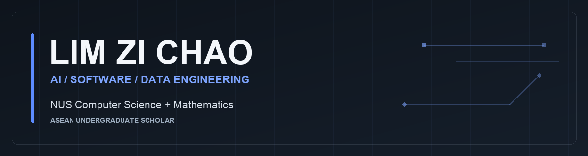

  <a href="https://www.linkedin.com/in/limzichao/"><strong>LinkedIn</strong></a>
  &nbsp; · &nbsp;
  <a href="mailto:zichao2006@gmail.com"><strong>Contact me</strong></a>
  &nbsp; · &nbsp;
  <a href="https://github.com/mysterious-joker?tab=repositories">Personal projects</a>
  &nbsp; · &nbsp;
  <a href="https://github.com/lzc-nus">NUS projects ↗</a>

# Hi, I'm Zi Chao

**I build search, data infrastructure, and AI systems—from hybrid retrieval to the pipelines that make agent workflows useful.**

I'm a **Computer Science undergraduate at the National University of Singapore**, pursuing a **second major in Mathematics** and holding the **ASEAN Undergraduate Scholarship**. Alongside my studies, I work on software, data, and AI systems at a quantitative trading firm.

- **5th place, TikTok TechJam 2026** — led a five-person team through a 72-hour build and presented our shopping copilot at TikTok Singapore.
- **Data Engineer Intern, Bright Point Capital / Theme International Trading** — building Python/SQL data infrastructure and AI-agent integrations.
- **Expected graduation: December 2028** — one semester early.

**Looking for 2027 internships in AI/ML, search, and data engineering.**

<strong>Internship availability</strong>

- **11 January–8 May 2027:** part-time, at least 3 days per week.
- **9 May–31 July 2027:** full-time.

[Let's connect on LinkedIn](https://www.linkedin.com/in/limzichao/) · [Email me](mailto:zichao2006@gmail.com)

## Featured work

### [Shopping Copilot · TikTok TechJam 2026](https://github.com/mysterious-joker/TTSC)

**Team lead · 5th place · Conversational search over 50,000 products**

I led a five-person team and designed the core hybrid retrieval architecture: SQLite FTS5 BM25, BGE-small INT8 ONNX embeddings, reciprocal-rank fusion, route gating, and structured-evidence reranking. The result is a deterministic, CPU-only shopping copilot with **zero runtime network or API calls**.

**Python · SQL · SQLite FTS5 · Dense retrieval · ONNX Runtime**

<strong>Explore the architecture, evaluation, and my contribution</strong>

- **My contribution:** retrieval architecture and implementation, team coordination across retrieval/dialogue/evaluation/preprocessing, and the final presentation.
- **Retrieval:** combine lexical and semantic search, fuse candidate rankings, route queries, and rerank using structured product evidence.
- **Evaluation:** 1.000 Hit Rate@10 across 200 official public-evaluation sessions.
- **Latency:** 44.43 ms p95 on the development machine.
- **Provenance:** a team implementation developed from a competition-kit fork.

[Read the code and technical documentation](https://github.com/mysterious-joker/TTSC) · [Team contributions](https://github.com/mysterious-joker/TTSC#team-contributions)

### [Plutus · NUS Orbital](https://github.com/lzc-nus/Plutus)

**Deployed · Full-stack financial platform**

Built and deployed a financial platform with protected user-data APIs, validated transaction workflows, and typed frontend/backend contracts.

**Next.js · TypeScript · FastAPI · PostgreSQL · Docker**

### [Green Chonk · NUS Software Engineering](https://github.com/lzc-nus/ip)

A JavaFX task companion with persistent todos, deadlines and events, date-aware scheduling, a command-line fallback, and regression tests. Developed from the NUS course starter.

**Java · JavaFX · Gradle · JUnit**

## Experience that informs my work

**Data Engineer Intern — Bright Point Capital / Theme International Trading**  
July 2026–present · Singapore

- Engineer Python/SQL infrastructure connecting market information and governed PostgreSQL datasets to analyst and AI-agent workflows.
- Architected a source-to-canonical commodity-data pipeline with transformation, validation, lineage, replayability, and controlled publication.
- Built API ingestion workflows and backfilled missing market data into Azure-hosted PostgreSQL.
- Prototyped semantic chunking, embeddings, vector retrieval, RAG, persistent agent memory, and MCP tool interfaces.

<strong>Earlier experience & academic foundation</strong>

**Student Associate — NUS Libraries** · December 2025–January 2026  
Automated batch document processing and output validation with PowerShell, improving naming, organization, and record consistency.

**NUS · B.Comp. Computer Science + Second Major in Mathematics** · 2025–December 2028 (expected)  
ASEAN Undergraduate Scholarship. Relevant coursework includes Data Structures & Algorithms, Software Engineering, Database Systems, Computer Organization, Data Science, Probability, Linear Algebra, and Calculus.

**Languages:** English and Chinese (native/bilingual); Malay (conversational).

## Technical toolkit

| Focus | Tools & methods |
| :--- | :--- |
| **Programming** | Python, SQL, Java, C++, TypeScript / JavaScript |
| **Search & ML** | BM25, dense embeddings, vector search, rank fusion, reranking, ONNX Runtime, Pandas, NumPy |
| **AI systems** | AI agents, MCP, RAG, semantic chunking, persistent memory |
| **Data engineering** | ETL / ELT, API ingestion, validation, lineage, replayability, PostgreSQL, Azure |
| **Application engineering** | FastAPI, REST APIs, React / Next.js, Docker, Git, testing & debugging |

---

**Two accounts, one body of work.** This is my primary profile for personal projects and professional work. My NUS coursework and school projects live at **[@lzc-nus](https://github.com/lzc-nus)**.

**Building something in search, data, or AI?** [Connect with me on LinkedIn](https://www.linkedin.com/in/limzichao/) or [get in touch](mailto:zichao2006@gmail.com).
