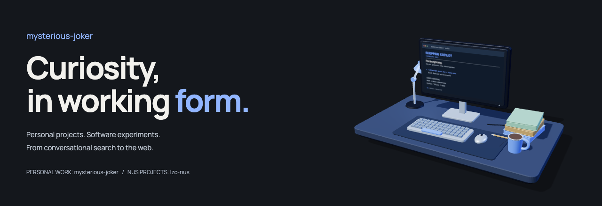

  <a href="https://mysterious-joker-studio.theme-intern-6210.chatgpt.site"><strong>Explore my interactive 3D studio</strong></a>
  &nbsp; · &nbsp;
  <a href="https://github.com/mysterious-joker?tab=repositories">Personal repositories</a>
  &nbsp; · &nbsp;
  <a href="https://github.com/lzc-nus">NUS projects: @lzc-nus</a>

## Hi, I'm mysterious-joker

This is my primary GitHub profile for personal projects and selected work—from conversational search to the web. My NUS coursework and school projects live at **[@lzc-nus](https://github.com/lzc-nus)**.

## Featured personal work

### [Shopping Copilot](https://github.com/mysterious-joker/TTSC)

An offline, CPU-only conversational search agent for **TikTok TechJam 2026**. It narrows a catalog of 50,000 products through clarifying questions and ranked recommendations, combining lexical and dense retrieval.

**Python · SQLite FTS5 · BGE embeddings · ONNX Runtime**

Team implementation in a competition-kit fork. [Read the architecture and team contributions →](https://github.com/mysterious-joker/TTSC#team-contributions)

## Selected work from my NUS account

| Project | What it does | Technologies |
| :--- | :--- | :--- |
| **[Plutus](https://github.com/lzc-nus/Plutus)** | Financial dashboard with portfolio and transaction workflows. A project by Two Sicilies. | Next.js, TypeScript, FastAPI, PostgreSQL |
| **[Green Chonk](https://github.com/lzc-nus/ip)** | Task companion with persistent todos, deadlines, events, and date-aware scheduling. NUS coursework built from the course starter. | Java, JavaFX, Gradle, JUnit |

[Explore all NUS repositories →](https://github.com/lzc-nus?tab=repositories)

---

**A little more interactive?** [Visit the 3D studio](https://mysterious-joker-studio.theme-intern-6210.chatgpt.site)—drag to rotate the desk, click the monitor to switch projects, or use the project buttons. The live experience opens outside GitHub; the banner above is a static render.
