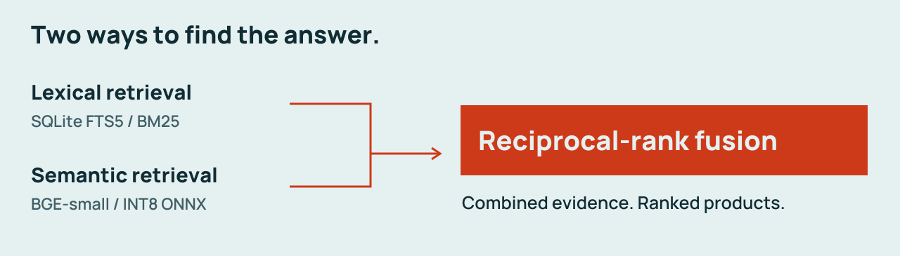

<!--
THESIS: An engineering monograph: distinctive authorship with evidence readers can inspect.
OWN-WORLD: Glacier and deep petroleum, a burnt-orange LZC monogram, oversized outlined Manrope, native GitHub prose.
STORY: Meet the engineer, inspect selected systems, understand experience, visit the portfolio or make contact.
FIRST VIEWPORT: Two-line name owns the left half; an original geometric LZC monogram occupies the right. Mobile recomposes vertically. Portfolio link and current role sit immediately below.
FORM: Computer-science monograph, candidate 7, seed e2c7aee5. User delegated direct design/build. No invented interaction; native disclosure reveals technical depth.
FINISH: unreviewed and undocumented is unfinished; this build ends with the finish review, the verdict, DESIGN.md, and every shipping raster carrying its provenance
-->

<picture>
  <source media="(prefers-color-scheme: dark) and (max-width: 600px)" srcset="assets/profile-header-mobile-dark.svg?v=3">
  <source media="(max-width: 600px)" srcset="assets/profile-header-mobile-light.svg?v=3">
  <source media="(prefers-color-scheme: dark)" srcset="assets/profile-header-desktop-dark.svg?v=3">
  
</picture>

  <a href="https://limzichao.com"><strong>Explore my portfolio</strong></a>
  &nbsp;&nbsp; / &nbsp;&nbsp;
  <a href="https://www.linkedin.com/in/limzichao/">LinkedIn</a>
  &nbsp;&nbsp; / &nbsp;&nbsp;
  <a href="mailto:zichao2006@gmail.com">Email</a>
  &nbsp;&nbsp; / &nbsp;&nbsp;
  <a href="https://github.com/lzc-nus">NUS work</a>

**I'm Zi Chao. I build search, data infrastructure, and AI systems.**

Year 2 Computer Science at the **National University of Singapore**, with a second major in Mathematics and the **ASEAN Undergraduate Scholarship**. Currently a **Data Engineer Intern at Theme International Trading** in Singapore.

I’m interested in the work between a promising idea and a dependable system: retrieval, data quality, explicit contracts, and the details that survive real use.

## Selected work

### [Shopping Copilot](https://github.com/mysterious-joker/TTSC)

**5th place · TikTok TechJam 2026 · Team lead**

50,000 products. At most ten conversational turns. An entirely CPU-based search agent, with no hosted models or runtime API calls.

<picture>
  <source media="(prefers-color-scheme: dark) and (max-width: 600px)" srcset="assets/copilot-mobile-dark.svg">
  <source media="(max-width: 600px)" srcset="assets/copilot-mobile-light.svg">
  <source media="(prefers-color-scheme: dark)" srcset="assets/copilot-desktop-dark.svg">
  
</picture>

I led a five-person team, designed and implemented the hybrid retrieval architecture, and presented the system at TikTok Singapore. Lexical and semantic search combine through reciprocal-rank fusion; route gating and structured-evidence reranking refine the results.

**Python · SQL · SQLite FTS5 · ONNX Runtime** 
[Source & technical documentation](https://github.com/mysterious-joker/TTSC)

<strong>Engineering notes & evaluation context</strong>

- **My contribution:** retrieval architecture and implementation, coordination across retrieval, dialogue, evaluation, and preprocessing, and the final presentation.
- **Design:** deterministic response paths, a frozen product catalog, and combined lexical/semantic evidence.
- **Recorded public-evaluation result:** 1.000 Hit Rate@10 across 200 official public-evaluation sessions.
- **Recorded response latency:** 44.43 ms p95 on the development machine.

These are development-set results recorded in the original profile, not production guarantees. Hardware, workload, and evaluation distribution affect performance. The team implementation began from a competition-kit fork.

[Team contributions](https://github.com/mysterious-joker/TTSC#team-contributions)

### [Plutus](https://github.com/lzc-nus/Plutus)

**Financial software · NUS Orbital, Apollo level**

A deployed financial workspace connecting assets, liabilities, cash flow, and planning. Protected user-data APIs, validated transaction workflows, and typed frontend/backend contracts support the experience.

**Next.js · TypeScript · FastAPI · PostgreSQL · Docker** 
[Explore the source](https://github.com/lzc-nus/Plutus)

### [Green Chonk](https://github.com/lzc-nus/ip)

**A task companion, built to remember**

A JavaFX application for todos, deadlines, and events, with persistent storage, date-aware scheduling, a command-line fallback, and regression tests. Developed from the NUS Software Engineering course starter.

**Java · JavaFX · Gradle · JUnit** 
[Explore the source](https://github.com/lzc-nus/ip) · [User guide](https://lzc-nus.github.io/ip/)

### [Ideas in Motion](https://limzichao.com)

**This work, in another dimension**

My interactive portfolio: two visual worlds, procedural Three.js scenes, scroll choreography, and accessible project case studies.

**React · TypeScript · Three.js · GSAP** 
[Enter the portfolio](https://limzichao.com) · [Source](https://github.com/mysterious-joker/portfolio)

## Behind the systems

**Data Engineer Intern — Theme International Trading** 
July 2026–present · Singapore

I work on Python/SQL infrastructure connecting market information and governed PostgreSQL datasets to analyst and AI-agent workflows.

- **Data pipelines:** architected a two-stage, Kimball-inspired ETLTL pipeline for S&P Global Commodity Insights (Platts) reports, from blob storage and APIs through staging, canonical integration, and publication.
- **Governed datasets:** designed source-aligned PostgreSQL staging with validation, lineage, replayability, and controlled publication for analysts and an internal MCP platform.
- **Market data:** retrieved vendor data through APIs and backfilled missing FactSet records into Azure-hosted PostgreSQL.
- **Ongoing exploration:** retrieval and RAG, image embeddings, persistent agent memory, MCP tool interfaces, and factor screening with information coefficient analysis.

<strong>Earlier experience</strong>

**Student Associate — NUS Libraries** 
December 2025–January 2026 · Singapore

Supported archival digitisation and cataloguing, including scanning, labelling, organising, and validating document records. Collaborated on a PowerShell automation workflow for batch renaming, output standardisation, and category-based organisation, then checked the outputs for consistency.

**Teacher — SJK(C) Poay Chai** 
May–July 2025 · Iskandar Puteri

Taught mathematics, languages, arts, and physical education, adapting lessons to different learning speeds. Developed clear explanations of abstract concepts while managing classroom activities and student engagement.

**Data Entry Officer, KYC Project — VentureHaven** 
February–March 2025 · Johor Bahru

Entered and validated client records across internal systems and spreadsheets. Reviewed compliance documents, organised records for traceability, and coordinated with clients and colleagues to resolve missing information.

**Boarding Assistant — Raffles American School** 
January–February 2025 · Iskandar Puteri

Supported students, parents, and staff in a multicultural environment, including translation and guidance. Coordinated schedules and activities, resolved routine student issues, and escalated concerns when needed.

<strong>Academic foundation</strong>

**NUS · B.Comp. Computer Science + Second Major in Mathematics** 
2025–December 2028 (expected) · ASEAN Undergraduate Scholarship

Coursework includes Data Structures & Algorithms, Software Engineering, Database Systems, Computer Organization, Data Science, Probability, Linear Algebra, and Calculus.

**Languages:** English and Chinese (native/bilingual); Malay (conversational).

<strong>Tools I reach for</strong>

| Work | Tools & methods |
| :--- | :--- |
| Programming | Python, SQL, Java, C++, TypeScript / JavaScript |
| Retrieval | BM25, dense embeddings, vector search, rank fusion, reranking, ONNX Runtime |
| Data | ETL / ELT, API ingestion, validation, lineage, replayability, PostgreSQL, Azure, Pandas, NumPy |
| AI systems | Agents, MCP, RAG, semantic chunking, persistent memory |
| Applications | FastAPI, REST APIs, React / Next.js, Docker, Git, testing & debugging |

<strong>Early experiments, still online</strong>

Back when I still coded by hand 🥲 Learning the basics. Blaming the compiler.

- [Peacock](https://peacock.limzichao.com/) — make a meme.
- [Viridian](https://viridian.limzichao.com/) — turn painting clues into art.
- [Rose](https://rose.limzichao.com/) — explore stock reports.
- [Chef Hachi](https://hachi.limzichao.com/) — cook with what you have.

## Have something worth building?

I’m happy to talk about search, data, AI, and collaborations that connect them.

**[Get in touch](mailto:zichao2006@gmail.com)** · [LinkedIn](https://www.linkedin.com/in/limzichao/) · [Portfolio](https://limzichao.com)

<strong>2027 internship availability</strong>

- **11 January–8 May 2027:** part-time, at least three days per week.
- **9 May–31 July 2027:** full-time.

---

Personal & professional projects here. Coursework and school projects at **[@lzc-nus](https://github.com/lzc-nus)**.
